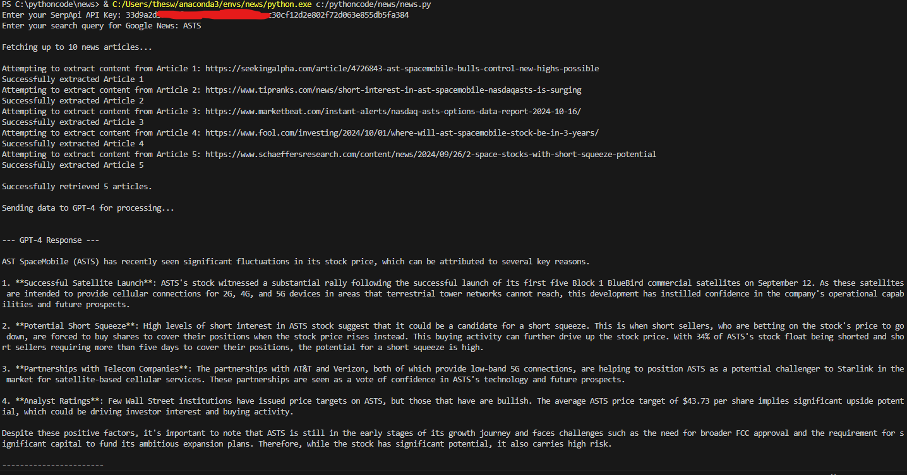

# Stock News RAG
This is a python implementation of a simple RAG system which searches the internet news articles based on the given query (a publicly traded company or stock symbol), and summarizes the reasons for a recent change in stock price.


## Serpapi
SerpApi is the tool used for Google searches. Up to 5 articles are grabbed for analysis. 

## OpenAI API
The code uses the OpenAI API to use the gpt-4o-mini model by default. It gives the retrieved articles in a simple prompt asking to summarize them focusing on the reasons for recent increase/decrease. 

## Requirements
```
pip install google-search-results newspaper3k openai
```


## Set environment variables (Optional)
```
export SERPAPI_API_KEY='your_serpapi_key'
export OPENAI_API_KEY='your_openai_api_key'
```

## Example:
